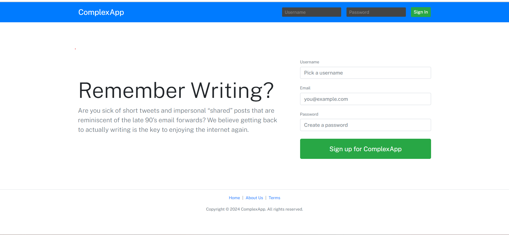

## Social Media Web App

### Overview
This is a full-stack social media web application designed to provide a seamless and engaging user experience. The application allows users to interact with their favorite content creators and peers, share updates, and communicate in real-time, all within a secure and user-friendly environment.

### Features
- **User Authentication**: Secure sign-in and sign-out functionality to protect user data.
- **User Profiles**: Create and manage user profiles, with the ability to follow and unfollow other users.
- **Create, Read, Update, Delete (CRUD) Operations**:
  - **Posts**: Users can create, edit, and delete posts, and upload media content.
  - **Search**: Search functionality to find and follow other users.
- **Real-Time Chat**: Chat feature to communicate with other users in real-time.
- **Interactive UI**: Modern, responsive design for an engaging user experience.
- **Security**: Enhanced security measures to protect user information and data.

### Technology Stack
- **Frontend**: HTML, CSS, JavaScript, React
- **Backend**: Node.js, Express.js
- **Database**: MongoDB

### Usage
- **Sign Up/Login**: Create an account or log in to an existing one.
- **Follow Users**: Follow your favorite content creators and other users.
- **Create Posts**: Share updates and media with your followers.
- **Chat**: Use the chat feature to communicate with other users in real-time.
- **Search**: Find and follow other users using the search functionality.

### Contributing
Feel free to submit issues and enhancement requests. Fork the repository to start contributing.

### License
This project is licensed under the MIT License.
